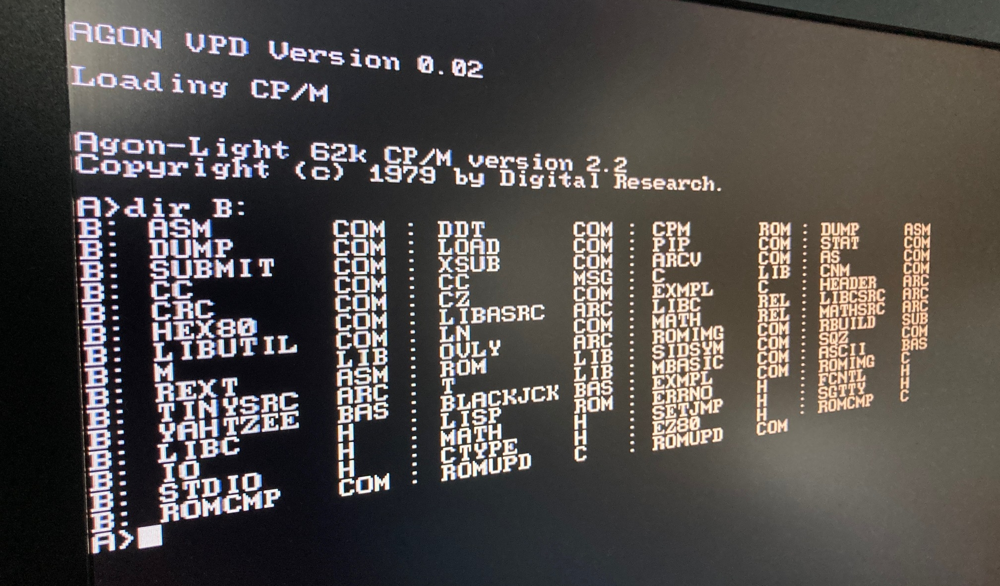

# Agon VPD for CP/M

An Ansi VT100 Terminal emulator for Agon-Light.

## What is Agon-Light

Agon is a modern, fully open-source, 8-bit microcomputer and microcontroller in one small, low-cost board. As a computer, it is a standalone device that requires no host PC: it puts out its own video (VGA), audio (2 identical mono channels), accepts a PS/2 keyboard and has its own mass-storage in the form of a µSD card.

More information about AGon-Light can be found [here](https://www.thebyteattic.com/p/agon.html)

## Why is this special version of the AGON VPD needed?

This is a special version of the Agon VPD that emulates an ANSI VT100 terminal. This is especially useful for CP/M since without any kind of terminal emulation CP/M applications are practically useless.

This is a stopgap solution till a final release of the Agon VPD that combines both terminal emulation and support for the various VDU commands of BBC Basic. 

A short video demoing CP/M with WordStar 4 on the Agon-Light can be found on [Youtube](https://youtu.be/CM3osNFsCNU)

**You will need to reprogram the ESP32 if you want to use BBC Basic again on Agon-Light since this overwrites the existing VPD.**
