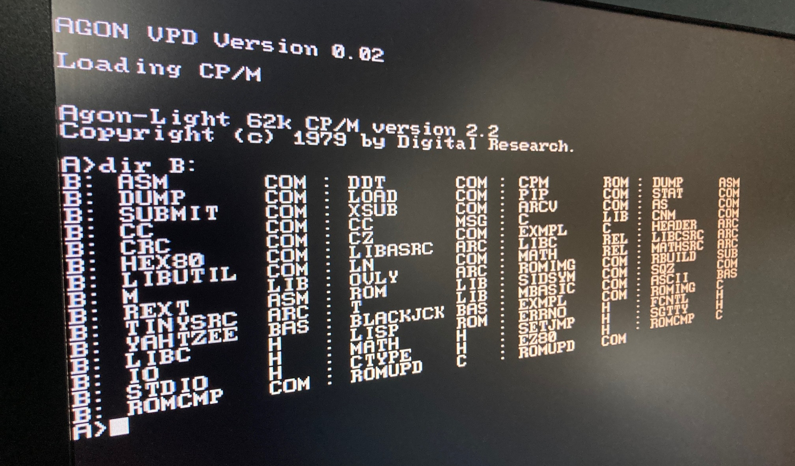

# Agon-Light CP/M




## Overview
This is a port of CP/M 2.2 for the Agon-Light eZ80 computer with fat file system formatted SD card.

This work is based on the work done by Christopher Farrar: [
z20x-cpm-00](https://github.com/cfarrar/z20x-cpm-00) where it's described as an an alpha of alphas.

The only work I've done so far is getting the code running on the Agon-Light. More work is definitely needed to make it fully usable. Which means that the mentioned shortcomings by Christopher Farrar are still there. The most important one, being the slow IO access to the SD Card.


## Current status

* UART 0 is used at 384000 baud (8N1) to communicate with the ESP32 for IO.
  * `AGON VPD Version 0.02` is assumed to be running on the ESP32.
* You need to hit the escape key at least once to start up CP/M on the eZ80 (communication/syncing at start up with with the ESP32 should be improved later).
* In the `disks` sub directory, you can find 6 ready made disk images which you can simply copy onto a FAT formatted SD Card. 
  * `cpmdiska.img` to `cpmdiskd.img` are the disk images provided by Christopher Farrar. 
  * `cpmdiske.img` contains Turbo Pascal 3.0.1
  * `cpmdiskf.img` contains WordStar 4
* For the moment, the names of the disk images are hard coded in the `disks.c` file and `SD_CARD_DISKS` defined in `sdparams.h`:
```C
    #define SD_CARD_DISKS (6)

    static TCHAR const *imageFileName[SD_CARD_DISKS] =
    {
        "cpmdiska.img"
      , "cpmdiskb.img"
      , "cpmdiskc.img"
      , "cpmdiskd.img"
      , "cpmdiske.img"
      , "cpmdiskf.img"
    };
```
* This setup is not really useful yet because at this moment `AGON VPD` has no terminal emulation capabilities. Which makes it hard to edit any kind of source code. Although `AGON VPD` is based on [`FabGL`](http://www.fabglib.org/) its VT100 terminal capabilities have not yet been enabled.
* ...

## Creating your own disk images

This can be done with the [cpmtools](http://www.moria.de/~michael/cpmtools/) utilities. For those familiar with the popular RC2014 systems, images created for [RC2014](https://rc2014.co.uk/) computers can also be used on the Agon-Light. The [ROMWBW](https://github.com/wwarthen/RomWBW) repository contains the full development environment for RC2014 computers, including the above mentioned `cpmtools`. Be aware that the `cpmtools` are for POSIX (Linux) operating systems. I found Windows versions of the `cpmtools` [here](https://www.cpm8680.com/cpmtools/) but I have no idea how well that works or not.

---

**Happy hacking.**